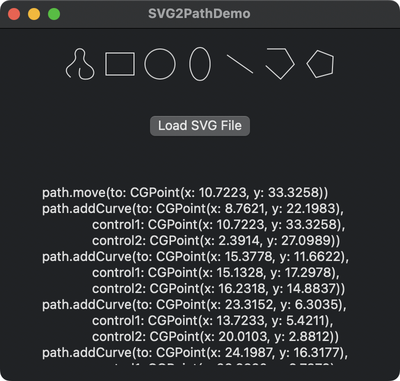

# SVG2Path

- Convert SVG to Path of SwiftUI.
- Output codes of the Path.

## Requirements

- Development with Xcode 16.0+
- Written in Swift 6.0
- Compatible with iOS 15.0+, macOS 11.0+

## Usage

```swift
let text = // String of SVG

let svg2Path = SVG2Path()
let data = svg2Path.extractPath(text: text)

// data.size := CGSize, width & height of viewBox
// data.paths := [Path], Path of SwiftUI

data.paths.forEach { path in
    Swift.print(path.codeString()) // Output code of SwiftUI Path
}
```

## Example

```svg
<?xml version="1.0" encoding="UTF-8"?>
<svg xmlns="http://www.w3.org/2000/svg" viewBox="0 0 100 100">
  <path d="M50.9042,67.4653s-9.3821-4.1698-5.2123-12.3605
    c4.1698-8.1907,13.403-6.2547,17.126-1.7871s4.1353,15.3631-5.659,19.2109
    c-10.4245,4.0953-23.5296-7.2972-22.3383-17.126,1.1914-9.8288,11.467-18.1685,15.7857-23.2318
    s11.1691-14.5199,8.2382-22.5306c-2.3386-6.392-7.3658-6.6978-10.1742,2.3517-2.6806,8.6375,
    .3114,19.127,2.6806,31.1246,5.8079,29.412,11.0202,40.9535,6.8504,47.655-4.1698,6.7015-14.8922,
    4.9722-16.3533-1.9202-1.92-9.0571,9.0561-8.3554,9.2051-2.3985s-5.9569,4.9144-5.9569,4.9144" />
</svg>
```

↓↓ `Path.codeString()` ↓↓

```swift
path.move(to: CGPoint(x: 50.9042, y: 67.4653))
path.addCurve(to: CGPoint(x: 45.6919, y: 55.1048),
              control1: CGPoint(x: 50.9042, y: 67.4653),
              control2: CGPoint(x: 41.5221, y: 63.2955))
path.addCurve(to: CGPoint(x: 62.8179, y: 53.3177),
              control1: CGPoint(x: 49.8617, y: 46.9141),
              control2: CGPoint(x: 59.0949, y: 48.8501))
path.addCurve(to: CGPoint(x: 57.1589, y: 72.5286),
              control1: CGPoint(x: 66.5409, y: 57.7853),
              control2: CGPoint(x: 66.9532, y: 68.6808))
path.addCurve(to: CGPoint(x: 34.8206, y: 55.4026),
              control1: CGPoint(x: 46.7344, y: 76.6239),
              control2: CGPoint(x: 33.6293, y: 65.2314))
path.addCurve(to: CGPoint(x: 50.6063, y: 32.1708),
              control1: CGPoint(x: 36.0120, y: 45.5738),
              control2: CGPoint(x: 46.2876, y: 37.2341))
path.addCurve(to: CGPoint(x: 58.8445, y: 9.6402),
              control1: CGPoint(x: 54.9250, y: 27.1075),
              control2: CGPoint(x: 61.7754, y: 17.6509))
path.addCurve(to: CGPoint(x: 48.6703, y: 11.9919),
              control1: CGPoint(x: 56.5059, y: 3.2482),
              control2: CGPoint(x: 51.4787, y: 2.9424))
path.addCurve(to: CGPoint(x: 51.3509, y: 43.1165),
              control1: CGPoint(x: 45.9897, y: 20.6294),
              control2: CGPoint(x: 48.9817, y: 31.1189))
path.addCurve(to: CGPoint(x: 58.2013, y: 90.7715),
              control1: CGPoint(x: 57.1588, y: 72.5285),
              control2: CGPoint(x: 62.3711, y: 84.0700))
path.addCurve(to: CGPoint(x: 41.8480, y: 88.8513),
              control1: CGPoint(x: 54.0315, y: 97.4730),
              control2: CGPoint(x: 43.3091, y: 95.7437))
path.addCurve(to: CGPoint(x: 51.0531, y: 86.4528),
              control1: CGPoint(x: 39.9280, y: 79.7942),
              control2: CGPoint(x: 50.9041, y: 80.4959))
path.addCurve(to: CGPoint(x: 45.0962, y: 91.3672),
              control1: CGPoint(x: 51.2021, y: 92.4097),
              control2: CGPoint(x: 45.0962, y: 91.3672))
```

## Demo

This repository includes a demo app.


